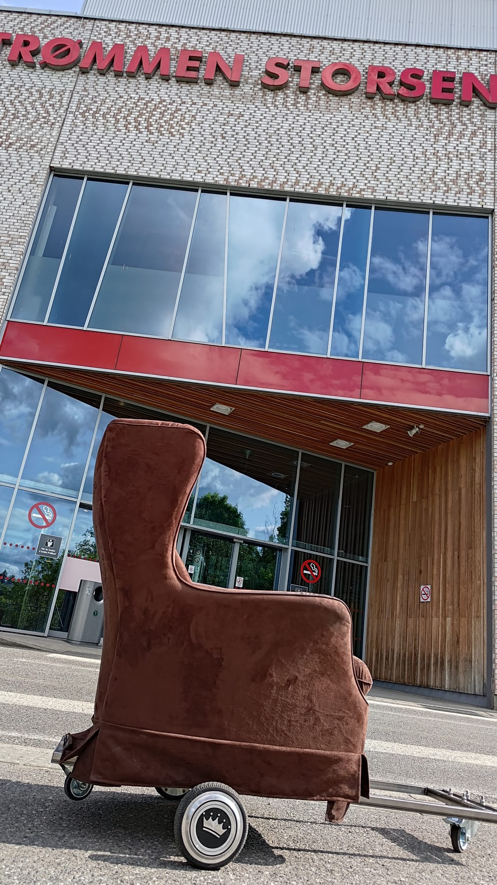
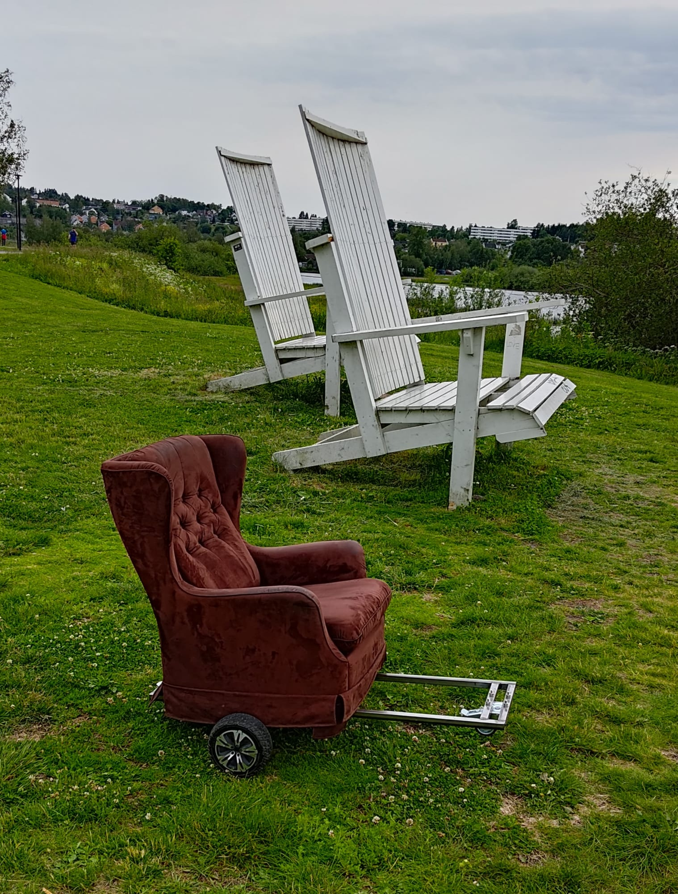

Every hoverboard I take apart leaves me with two brushless hub motors and motor controllers. Eventually you run out of sensible things to bolt them to. So I bolted them to a
brown velvet wingback armchair.

It steered, it cruised, and it had absolutely no reason to exist. Which was the whole point.

*The throne, out for a spin at Strømmen Storsenter.*

*Chilling with friends.*

_(More build details to come: motor controllers, wiring, and how it actually drives.)_
