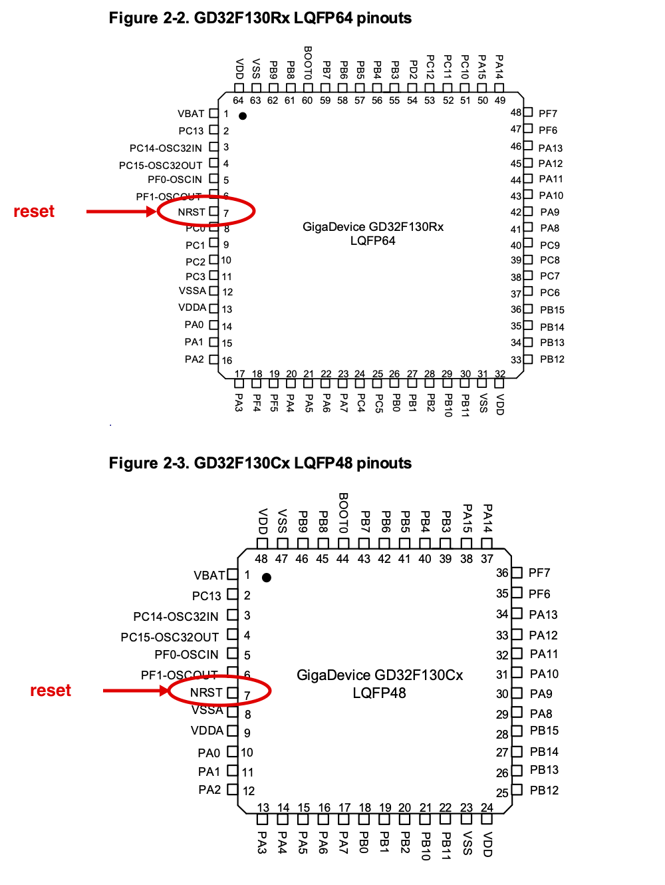
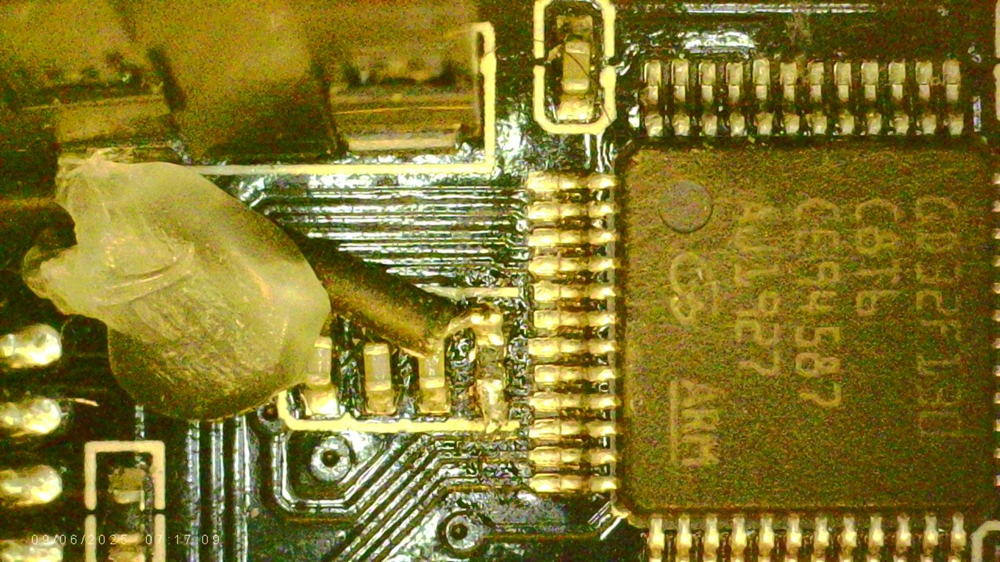

While building [runtime-hal](https://github.com/hoverboardhavoc/runtime-hal), my one-binary-runs-on-any-chip HAL, I started bricking GD32F130C8 hoverboard controllers, and the pile kept growing. The pattern was deceptive. The test firmware would be flashed with the board running on ST-Link power, and everything looked good: it ran, it reported back, the debugger stayed happy. The board was then moved onto the bench PSU with its peripherals wired up, motor phases, hall sensors, LEDs, and on that reboot it would come up locked out over SWD and refuse to come back. Because the failure only ever showed up *after* the move, I went hunting for an electrical cause: the connected peripherals dragging something down, or the handover from ST-Link power to the PSU stressing the part. Wrong place to look. Nothing was damaged. The boards were asleep, and the thing that woke them up was the reset pin.

## The symptom that looks exactly like a brick

After flashing the detect/probe firmware and power-cycling, a normal SWD connect gives a convincing picture of a dead chip. The debug port answers and the access port can be **read**, but every **write** to the access port aborts, so the debugger can never halt, examine, or flash the core. OpenOCD just reports "Examination failed."

Read more carefully, this might be what is going on at the debug-interface level: the identifiers come back as the normal Cortex-M3 values (`DPIDR 0x1ba01477`, AHB-AP `IDR 0x24770011`), the control/status looks powered-up with no errors, and only the access-port write fails. Those are ARM CoreSight debug registers, defined in ARM's [Debug Interface Architecture Specification (ADIv5)](https://developer.arm.com/documentation/ihi0031/latest) rather than the GD32 datasheet, so take the exact reading as the probe's report, not gospel. The part that is hard to get wrong is the behaviour: reads succeed, the write aborts, on **every boot**. That repeatability is what made me write "AP-write damage, the part is gone." A part that reads but won't write, every boot, looks like something physical died.

## The trap that cost hours

The textbook recovery for "firmware is doing something that locks out the debugger" is **connect-under-reset**: assert the chip's reset line so the firmware never gets to run, attach the debugger while the core is held in reset, and deal with the flash from there. I was doing exactly that. It kept not working.

The reason is a detail about my cheap tooling that is easy to miss: **my ST-Link V2 clones do not drive NRST.** On the clones I happen to own, the internal reset GPIO is not routed to the header (others might wire it; mine don't). So every `connect_assert_srst` I issued was a **silent no-op**. The reset line never moved, the firmware ran anyway, and it re-locked the chip on every boot. The recovery procedure was correct; my probe just wasn't physically doing the one thing the procedure depends on. (The RoboDurden wiki documents a [PB0 bodge to add NRST to these clones](https://github.com/RoboDurden/Hoverboard-Firmware-Hack-Gen2.x/wiki/adding-NRST-on-stlink-v2-clones); I confirmed with a toggle script that the clones produce no pin movement at all.)

That deadlock, firmware re-locking the chip on every boot while the resets did nothing, only broke with a probe that drives NRST for real: an ESP32 running [my port of the elaphureLink CMSIS-DAP firmware](https://github.com/hoverboardhavoc/wireless-esp32-dap). With that probe actually holding the core in reset, the chip **examined fine and the AP write worked.** The "damage" evaporated. The lockout was a runtime effect of the firmware, not a property of the silicon.

## What the firmware was actually doing

The firmware ended, as a lot of firmware does, in a loop calling [`cortex_m::asm::wfi()`](https://docs.rs/cortex-m/latest/cortex_m/asm/fn.wfi.html):

```rust
loop { cortex_m::asm::wfi() }
```

A Cortex-M that enters **WFI sleep** with none of the debug-low-power bits set will lock out SWD re-attach. Once it has detached, the debugger cannot re-attach to and halt a sleeping core (WFI and the sleep modes are documented in the [Cortex-M3 TRM, Low power modes](https://developer.arm.com/documentation/ddi0337/h/nested-vectored-interrupt-controller/nvic-functional-description/low-power-modes)). The textbook way out is connect-under-reset: hold the reset line so the firmware never runs, which is exactly why driving NRST worked. This is a **general Cortex-M gotcha, not a GD32 quirk**, though I should be precise about what I actually saw: I only ever tripped it on the **GD32F130** boards, never on the F103 side. The mechanism is generic, so I would not call the F103 immune, it just never bit there for me.

I proved it two ways. First, controlled: in the bench firmware I changed only the `wfi` to a busy `nop` spin, and the board came back clean across a cold power-cycle while the old `wfi` build kept locking. Then in pure isolation: a firmware that does nothing at all except write a marker to RAM and `loop { wfi() }`, with no detection code, no clock or GPIO setup, nothing, also locked the board after a power-cycle. So `wfi` by itself is sufficient. None of the clever detection code I had been suspecting was involved.

It re-induces on every boot because the firmware re-enters `wfi` every boot, which is precisely what dressed a one-line sleep up as permanent "write damage."

## The recovery

With a probe that can hold reset, the fix is mechanical: hold the core in reset so the firmware never runs, halt at the reset vector, and mass-erase the offending firmware.

```sh
# connect under reset, halt, wipe the firmware that keeps re-locking the part
openocd ... -c 'reset_config srst_only srst_nogate connect_assert_srst' \
            -c 'adapter speed 100' -c init -c 'reset halt' \
            -c 'stm32f1x mass_erase 0' -c shutdown
```

After that, a normal connect with no reset trick at all examines cleanly, the AP write succeeds, and flash reads back `0xFFFFFFFF`. Completely normal board. Confirmed on the first of the four; the other three are the same fault and the same fix.

## The reset pin, up close

All of this hinges on being able to actually drive one pin. On the GD32F130, **NRST is pin 7** whichever package you have, top of the left edge next to the oscillator pins, on both the 48-pin `GD32F130Cx` and the 64-pin `GD32F130Rx`. The boards I bricked and recovered here are the 48-pin C8 split-board controllers, but I have seen 12-FET hoverboards built around the bigger 64-pin part, so it is worth knowing the reset pin sits in the same place on both.



NRST is on the left edge of the package (RoboDurden's [GD32F130 v20 board files](https://github.com/RoboDurden/Hoverboard-Firmware-Hack-Gen2.x/tree/main/target_1%3DGD32F130/v20) cover this board). Rather than land on the fine 0.5 mm-pitch lead itself, I soldered to the top of the little component sitting on pin 7, the one whose other end runs to pin 8, VSSA. A small part from reset to ground like that is almost certainly the NRST filter capacitor, and its body is a far more forgiving pad than the lead. Then I pinned the wire down with a blob of hot glue.



It is a fragile setup, a single hair-thin wire held by glue, and not one to copy unless you have to. If your probe can pull that line low and hold it, the firmware never runs, the lockout never happens, and the board is trivially recoverable.

## The fix, so it never happens again

Two parts. The first is done and verified on silicon; the second is a theory I still want to try:

1. **Bench firmware does not sleep.** The detect/probe/coldpath validators now busy-spin (`loop { nop() }`) instead of `wfi`. They have no reason to save power, and a busy spin never locks the debugger out.
2. **Firmware that must sleep should hold debug alive (a theory, not yet tried).** I have not done this one; it is what I want to try, and it might work. The idea: before any `wfi`, set the GD32F1x0 `DBG_CTL0` register (at `0xE004_2004`), `SLP_HOLD` for WFI sleep, plus `DSLP_HOLD` and `STB_HOLD` for deep-sleep and standby, the GD32 equivalent of STM32's `DBGMCU_CR` sleep/stop/standby bits. `DBG_CTL0` powers up as zero, so the firmware would have to set it early, on every boot, before it ever sleeps; a debugger setting it in a live session is lost on the next cold boot.

The broader lesson is the one I will keep: when a board reads but won't write on every boot, before you decide the silicon is dead, make sure your probe is actually driving the reset pin. Mine wasn't. None of the four were damaged, but they were not simply fine either: each one needed that fiddly bodge wire onto the reset cap before a probe with a real NRST could bring it back.
