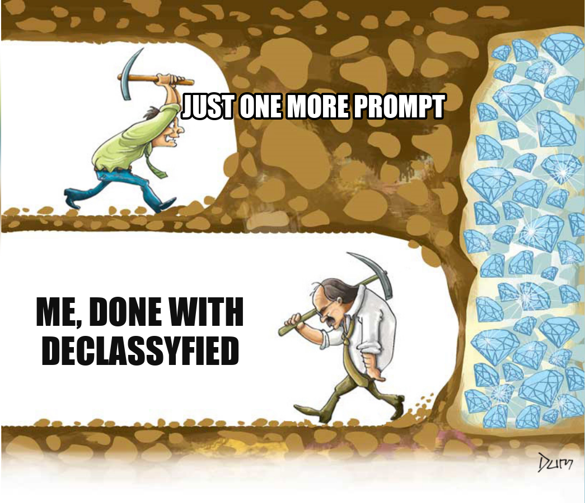

[The plan for this week](/blog/week-25-the-plan/) was to get the ClassyWalk board to balance on its own sensors and take drive and steer commands over its built-in wireless module at the same time, all from a clean-room reproduction of the stock firmware. That project was called Declassyfied, and it has been abandoned. The clean-room firmware balanced but was never rideable, and rather than keep grinding on it I pivoted mid-week: give up on reproducing the exact functionality of the ClassyWalk, and build my own open firmware for these boards instead.

## Declassyfied: balanced, never rideable, abandoned

Monday and part of Tuesday went into the clean-room reproduction. The board could balance: it would stand up and respond to pitch. But it was never rideable, and the core problem was that the values we thought we had recovered from the stock firmware did not behave as expected on the board, that or some other bug I never tracked down. The PID gains are the clearest example. In the stock firmware the pressure pads seemed to change the gains, soft one way and stiff another, but the numbers we pulled out did not reproduce that. And the stock firmware itself was inconsistent: sometimes it balanced with no rider on the board, other times it did not, and I never worked out why. Without trustworthy recovered values, I could not reproduce it.

The failure mode I want to name is the loop I fell into: ask an LLM for the next change, flash it, watch it still not work, and believe each time that *this next suggestion is going to fix all the things*. It never was. The suggestions were plausible and the loop felt like progress, but it was just churn. It is an LLM slot machine: every prompt is another pull of the lever, the next one always feels like it could be the jackpot, and you keep feeding it coins long after the expected value has gone negative. It is the digging-for-diamonds cartoon: maybe the very next swing breaks through to the diamonds and the turn after this one is the one that fixes Declassyfied. But the whole joke of that picture is that you cannot see how close the diamonds are, and I had had enough of swinging to find out.

 After a day and a half of it I called it: the clean-room reproduction of one specific board's firmware is a grind with a moving target, and it was not getting closer to a board I could ride. **Declassyfied is shelved.**

## The pivot: a universal firmware for hoverboard motor controllers

Same goal, an open and rideable board, but no longer bound to faithfully recreating the stock firmware, and no longer tied to one board. The target is a **single binary that runs across the whole family of these hoverboard controllers**. The **chip** is discovered: the firmware probes at boot what MCU it is running on, no help needed. The **board layout** is configured at runtime, not decided at compile time: which pins drive the motor phases, where the hall sensors and IMU sit, what the buttons and LEDs are wired to. Every hoverboard firmware needs that description, and every other one bakes it in at compile time with per-board defines, so each variant (an EFeru-style 12-FET board, a split board, any wiring change) is its own compiled binary. Here it is stored on the board and editable live: one binary, reconfigured rather than recompiled.

The chip side is the part that splits into two register families the firmware bridges at runtime, and the split is a quirk worth spelling out. What the parts share is the **Cortex-M3 core**, not the peripherals:

- The **F103** parts (STM32F103, GD32F103) are genuine **STM32F1**: GPIO on the APB bus configured through the legacy `CRL`/`CRH` registers.
- The **GD32F130** is a Cortex-M3 core too, but GigaDevice skipped the legacy STM32F1 peripherals and gave it **ST's newer-generation peripheral style**: GPIO on the AHB bus with a decomposed config model and an explicit per-pin alternate-function mux (`CTL` plus `AFSEL`), not the F1's APB-mapped `CRL`/`CRH` and separate remap block. The closest single ST relative at the peripheral level is the STM32F0 line, except the F130 pairs that newer peripheral set with a Cortex-M3 core where the STM32F0 is Cortex-M0.

Reconciling those two register models at boot is the whole job. The boards themselves fall into:

- **Gen2 twin / split boards**, where each wheel has its own half-board. These run a **GD32F130C8T6** per side (the ClassyWalk is one of these), or in some cases a **GD32F103C8T6**. Same chips RoboDurden's Gen2.x hack targets.
- **12-FET single mainboards**, the classic layout where one board drives both hub motors off twelve MOSFETs. The brain there is an **STM32F103RCT6**, or on some boards a **GD32F103RCT6** (the high-density 256 KiB part).

One image covering both the F130 split boards and the F103 12-FET boards is the whole point: no per-board build, no recompile to move between them, the chip is detected at boot and the board is selected by configuration. The **sideboards** that come with the 12-FET boards (the small auxiliary boards on the sensor cables) run an F130 themselves, so the same binary already covers them at the chip level. Putting it on them is a matter of prioritization, not of hardware: the detection handles the part already, it is just a question of when I build out their role.

That splits into two repos, and both got built this week from a standing start.

## runtime-hal: one binary detects the chip and runs anywhere

[`runtime-hal`](https://github.com/hoverboardhavoc/runtime-hal) is the foundation. It is a Rust HAL for STM32F1-compatible Cortex-M3 parts (the GD32 F103 and F130 families these boards ship) where **one binary boots on any supported chip and works out what it is at runtime**. There is no compile-time chip selection, no per-chip PAC crate, no descriptor data file. The chip identity is discovered, not configured.

Three heuristics run once at boot, before any peripheral comes up:

- **Family probe.** The two families put GPIOA at different addresses. The probe deliberately reads the *wrong* family's reserved GPIO region; on Cortex-M3 that raises a precise BusFault, which is an unambiguous "not that family", while a clean read confirms it. The HAL owns the fault handling entirely (it installs its own probe-scoped vector table and steps the return PC past the faulting load), so the application writes no fault-handler boilerplate. That one determination selects the GPIO, clock, ADC, and IRQ register models.
- **Measure peripherals, do not infer them.** The advanced-timer and ADC instance counts are measured by writing a pattern to a benign scratch register and reading it back, not taken from a per-family constant. This earned its keep immediately: on real silicon the family constant was wrong **in both directions** (a GD32F103C8 has 1 advanced timer where the constant said 2, a GD32F103RCT6 has 3 ADCs where it said 2). Measuring is the only thing that gets it right.
- **Fail loud.** If neither family matches, detection returns an error and the firmware stays safe on the reset clock rather than guessing a register layout.

What is validated on real silicon: family detection and peripheral measurement, the clock tree, and the cold-path peripherals (USART including a polled link between two boards, hardware I2C confirmed against an IMU at 0x68, SPI, and the regular ADC) on a GD32F103C8 and a GD32F130C8, plus detection on a GD32F103RCT6.

The **motor hot path now spins real motors.** There are example applications that drive a hub motor with hall-driven **six-step (block) commutation**, and the headline is that the *same image* does it on **both an F103 and an F130**: one binary, flashed unchanged to the GD32F103C8 master or the GD32F130C8 slave of the bench split board, the chip detected at boot, spinning the motor under hall feedback. A second example brings the **12-FET dual-motor F103RCT6** board up on real hardware. What is still bench-unproven is the closed-loop side, the timer-triggered injected-ADC current sensing and the higher commutation modes (sinusoidal, FOC), which are implemented and checked by register-trace comparison against the GD32 SPL but not yet run.

There is also an in-repo golden-comparison harness behind all this: a Unicorn-based MMIO trace extractor, an SPL-versus-runtime-hal register-trace comparison, a planted-bug self-test, and CI. That is what lets the cold path claim "matches the SPL" with evidence instead of hope. I wrote up the [prior art](https://github.com/hoverboardhavoc/runtime-hal/blob/main/docs/prior-art.md) too: every underlying technique (fault-tolerant probing, write-back presence detection) is established, but I found no prior example of this exact combination, picking the register model by a boot-time deliberate fault and counting peripherals by write-back, in one binary with no descriptor.

The firmware that sits on top of all this, [`hoverboard-firmware`](https://github.com/hoverboardhavoc/hoverboard-firmware), got its start this week too: the architecture spec, the host-testable protocol crates, and a first assembled control firmware. What it is aiming for (config on flash, twin boards and sideboards, the IMU and foot pads, the built-in Bluetooth, the commutation modes) is a write-up for another day.

## Where this goes

The trade I made this week was to stop polishing a faithful copy of one board and start building something I can actually ride and others can actually use. The runtime-HAL bet is the interesting one, and getting the cold path working on three different GD32 parts, then spinning motors on two of them, is real evidence it just might work. The week itself felt frustrating, but I am ending it hopeful for next week.
