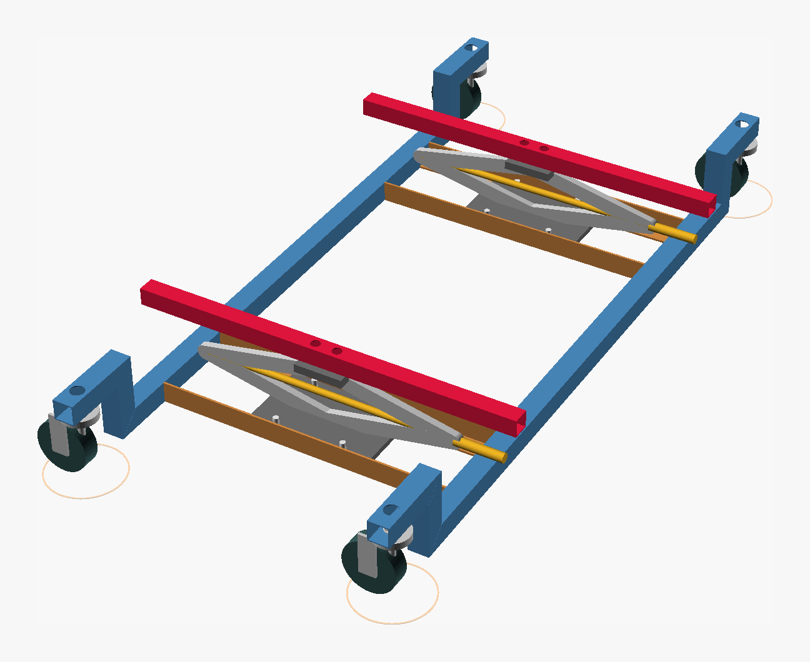

## The Mitsubishi i-MiEV

I like these cars. This is the third one I have owned. The same car was also sold as the Peugeot iOn and the Citroën C-Zero. It is a golf cart you can commute in: it does motorway speeds, more or less, seats four adults, and is slim enough to park anywhere.

I bought this one last year for 7500 kr, about 800 USD. Then the onboard charger packed up. It is a common fault on these, and one I might have been able to fix, but the car has other problems too: the air-conditioning pump makes a lot of noise, and there is a hole in the floor. The battery pack itself looks promising: all 88 cells are within 10 mV of each other after months with the 12 V battery flat. The point of pulling it is to get the cells for the [hoverboard wheels](/blog/week-26-the-plan/).

New, the pack is 16 kWh: 88 GS Yuasa LEV50 cells at 3.7 V and 50 Ah, in ten modules of eight cells and two of four. An eight-cell module is 30 V nominal, which is what the hoverboard motors want. The shop equivalent is LiFePO4: two 12 V 100 Ah batteries in series give 25.6 V and 2.6 kWh for about 14,000 kr (1,500 USD) at [Sparelys](https://www.sparelys.no/butikk/batteri-og-tilbehor/lithium-batterier), or a single 24 V 100 Ah unit is 18,000 kr. The car has ten eight-cell modules, and it cost 7500 kr. The trade is chemistry. LiFePO4 is safer, holds a flatter voltage, and is rated for several times the cycles. The LEV50 is a manganese-based lithium-ion cell at 3.7 V instead of 3.2 V, and these have had years of use.

## How others have done it

A few other people have filmed dropping the pack without a lift.

<link rel="stylesheet" href="https://cdn.jsdelivr.net/npm/lite-youtube-embed@0.3.4/src/lite-yt-embed.css">

<lite-youtube videoid="2AmLVrJNkxk" playlabel="Play: HV battery repair part 2"></lite-youtube>

Gary12345's HV battery repair, part 2. He supports the car on motorbike scissor jacks and gets the pack out at a modest ride height. The [forum thread behind the series](https://myimiev.com/threads/i-miev-hv-battery-fault-diagnosis-hv-battery-removal.5627/) describes the jacks.

<lite-youtube videoid="NQrSI4B0104" playlabel="Play: Replacing an Electric Car Battery Pack, part 1" params="start=900"></lite-youtube>

Replacing an Electric Car Battery Pack, part 1. The whole removal, opening at the drop itself on a single motorcycle lift under the middle of the pack.

<lite-youtube videoid="lVxA6AnQUY8" playlabel="Play: Mitsubishi Imiev battery removal" style="background-image: url('https://i.ytimg.com/vi/lVxA6AnQUY8/hqdefault.jpg')"></lite-youtube>

Mitsubishi Imiev battery removal. This one is done on a lift, but it is the most detailed walk around the connectors and which under-tray bolts to take out first.

The written method, from [5by9.net](https://5by9.net/prune_batteries/pack_removal.html), replaces four of the mounting bolts with threaded rods and winds the pack down onto dollies. It works, but it is slow. The motorcycle lift is quicker, and in the video the pack is a bit wobbly on it on the way down. So the plan here is two scissor jacks tied into a welded frame, with the pack resting on two bars instead of one small platform.

## The cradle

The goal for the week is to get the pack out of the car and onto the floor. Instead of rods or a single lift, I am going to weld a frame around two scissor jacks and lower the pack on that. The frame is modelled in OpenSCAD, and the model is what the steel gets cut from.

  <button type="button" class="scad-viewer-start">Render live in your browser (loads 14 MB OpenSCAD)</button>
  

<link rel="stylesheet" href="/imiev/cradle-viewer.css">

