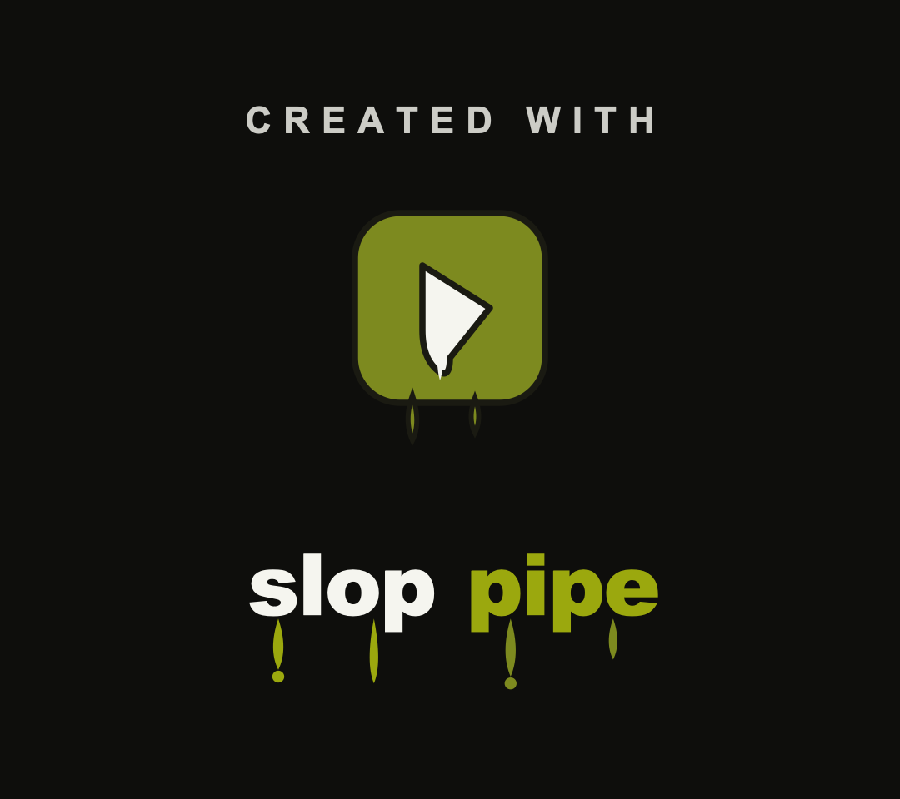

A short note on what I have been doing this week. A few of these are squarely on-brand for this site (hoverboards, reverse engineering); a couple are the tooling that grew up around making videos about the rest.

## BalanceAgain: driving a hoverboard over its own Bluetooth chip

The boards I work on are what [RoboDurden](https://github.com/RoboDurden/Hoverboard-Firmware-Hack-Gen2.x) calls a Gen2 hoverboard: rather than a single mainboard, it runs two twinned motor-controller boards, one per hub motor, talking to each other over UART. The two boards use different MCUs: one a **GD32F103**, the other a **GD32F130**. Both are GigaDevice's GD32 parts, register- and pin-compatible with the STM32F103 family but GigaDevice's own silicon, not exact ST clones (over SWD they report a non-ST revision masquerading as an STM32F1 medium-density). In RoboDurden's numbering these are the 2.1.20 and 2.2.20 boards, and he keeps a separate firmware repo for each. Neither chip had its readout protection enabled, so I could connect over SWD and pull a complete flash dump off each, nothing to defeat first.

From there it is the usual ladder: the dumps go through [Ghidra](https://ghidra-sre.org/), and I work the disassembly into a recompilable reconstruction, checked against the original by a [Unicorn](https://www.unicorn-engine.org/)-based emulator that runs both and compares them. That reached a bit-exact match this week, which matters mostly as a foundation. Once you can faithfully reproduce the firmware's behaviour, you understand it well enough to change it safely.

The payoff was the Bluetooth link. One board carries a BLE module: a TTC2541, which is a small module built around a TI CC2541, the same BLE 4.0 silicon as the common HM-10, talking to the MCU over its own serial port, USART3 (the board-to-board link is USART2; the Bluetooth sits on USART3). The stock firmware assembles its config commands on the stack a byte at a time, so the strings don't appear in a naive dump, but Ghidra recovered them. The board advertises itself as "ClassyWalk", switches the module into transparent UART pass-through, then speaks a simple XOR-checksummed binary protocol over it (framed status, telemetry, and settings messages). I wrote that all up as a spec for the module.

The decisive finding: the OEM Bluetooth protocol only exposes telemetry and configuration, that is, battery / speed / fault readout, a *speed limit*, lock, and lights. It has no live throttle or steering command, so you cannot remote-drive the stock board just by speaking its own protocol. To drive over the built-in radio you have to own the firmware. So I did: I modified RoboDurden's open-source firmware to take a drive command in over that same Bluetooth chip and feed it to the motors. The result is remote control of the motors through the board's own Bluetooth hardware, with no added microcontroller or sidecar.

(One smaller finding fell out along the way: comparing the dead-time / shoot-through config of the stock firmware against RoboDurden's build, the stock firmware runs the more aggressive dead time, and RoboDurden's "sine needs no dead-time" branch turns out to be dead code gated on a misspelled `#ifdef`.)

## Slop Pipe v2: a declarative video renderer that compiles to the browser



Slop Pipe is "OpenSCAD for video": a plain-text `.slop` file is the single source of truth, and a render is a deterministic function of it. Here is the actual source for one of this week's renders, a ~50-second vertical edit of an electric-vehicle build (media filenames swapped for descriptive placeholders). The whole edit, narration, captions, transitions, redaction and all, is this one file:

```text
output  9:16  1080x1920 @30fps  max 60s  reframe crop
normalize  fps 30, loudness -14LUFS, orientation auto
fade in 0.6
fade out 0.6

voice chatterbox:Jens
captions karaoke style cap
redact faces
redact plates

# captions show the real words; TTS says them the Norwegian way
pronounce elbil          "El Beel"
pronounce Pal            "Pal"
pronounce EPAL           "E-Pal"
style cap font Inter size 56 color #f5f5f5 box #000000cc pad 16 radius 16 pos bottom

# --- sources (named handles -> real project media) ---
source chuck     "hub-in-lathe.jpg"        # hub spinning in the lathe chuck
source shoplathe "lathe-boring-hub.jpg"     # lathe boring the hub
source press     "hydraulic-press.jpg"      # hydraulic press joining the wheels
source dualwheel "joined-drivetrain.jpg"    # the joined drivetrain
source pallet    "rig-on-pallet.jpg"        # drivetrain + batteries on a euro-pallet
source norwaycar "elbil.jpg"                # a Norwegian elbil (electric car)
source escooter  "escooters.webp"           # a row of elsparkesykler
source build     "phone-driving-wheels.mp4" # phone app driving the wheels
source yard      "carry-to-yard.mp4"        # carrying the rig out to the yard
source firstgo   "first-roll.mp4"           # tentative first roll
source roll      "hero-turn.mp4"            # HERO: leaning into a turn
source logo      "hoverboard-logo.jpg"      # hoverboard-havoc logo (round-masked)
source sloppipe  "sloppipe-outro.png"       # "created with slop pipe" outro card

# --- splash (quick flash): authored from primitives, not a baked PNG ---
card for 0.6s
+ photo logo mask circle border #ff5a00 10 glow pos center size 0.62
+ title "Hoverboard Havoc" pos bottom

# --- hook ---
title "The first step to building an electric vehicle"  style bold-center  for 1.8s  transition dip 0.3
style bold-center font Inter size 72 color #ff5a00 pos center

# --- the build, in order (narration leads) ---
vo "My friend machined the hubs of two hoverboard wheels,"
+ photo chuck ken-burns zoom 1.05->1.3

vo "turning them down to share a single axle,"
+ photo shoplathe ken-burns center->top zoom 1.1->1.4

vo "and pressed the two wheels together."
+ photo press ken-burns top->bottom zoom 1.05->1.3

vo "One drivetrain."
+ photo dualwheel ken-burns left->right zoom 1.0->1.2

vo "Two hub motors, driven from your phone."
+ clip build 0:01 -> 0:06 punch-in 1.15

# --- start small: the pallet rig + the name joke ---
vo "In engineering, you start small and build up."  transition dip 0.3
+ photo pallet ken-burns top->bottom zoom 1.05->1.25

vo "And in Norway, every electric vehicle's name starts with El."
vo "For example, an elbil,"
+ photo norwaycar fit ken-burns zoom 1.0->1.06
+ redact text "<url-on-car>"

vo "or an El-sparkesykkel."
+ photo escooter fit ken-burns zoom 1.0->1.06

vo "So ours is an Elektrisk Pal. An EPAL."
+ photo pallet ken-burns zoom 1.25->1.55

# --- out into the world, the ride pays off ---
vo "We carried it out to the yard,"  transition dissolve 0.3
+ clip yard 0:00 -> 0:03
+ redact text "<company-on-sign>"

vo "and the first ride was a little nervous."
+ clip firstgo 0:00 -> 0:03 punch-in 1.1
+ redact text "<company-on-sign>"

vo "Then it clicked. And it absolutely rides."
+ clip roll 0:10 -> 0:16 zoom 1.0->1.3
+ redact text "<company-on-sign>"

# --- created with slop pipe (outro) ---
photo sloppipe for 1.8s  transition dip 0.4
```

I paused the v1 prototype, which had grown a second in-browser renderer that diverged from the first endlessly, and rebuilt v2 as a CLI-only, single-renderer restart. It went from spec to genuinely capable in one long session: a custom Rust compositor (no MLT), Python fully removed from the render path, narration-led DSL with karaoke captions locked to the audio by real forced alignment, auto-redaction of faces and text via Apple Vision, transitions, and config-driven brand fonts.

The payoff for stripping Python and writing native rasterizers: **the render core compiles to WASM and runs end-to-end in the browser**. A spike proved the full loop (WebCodecs decode, WASM composite, WebCodecs encode, mp4 out) works in Chrome. The whole point is that the browser path is the *same* Rust compiled to wasm, not a reimplementation, so the pixels cannot diverge. That sidesteps the exact thing that killed v1.

## Video analysis: a cut-pacing analyzer

A tool to analyze the cuts and pacing of successful videos (average shot length, cut cadence, hook patterns) and emit a transferable *rhythm signature* rather than a recording: everything normalized to a 0-to-1 time axis and emitted as distributions and curves, not raw timestamps. It is being reframed as the rhythm engine that feeds Slop Pipe's editor.

## Plumbing

This site shipped (Astro on GitHub Pages, custom domain, cookieless, dark flame theme). And I built a small pair of scripts so my tmux layout *and* the live Claude Code conversations in each pane come back after a reboot, since the off-the-shelf tools cannot recognize the panes or resume the sessions.

More detail on the firmware reconstruction and the video renderer to come in their own posts.
